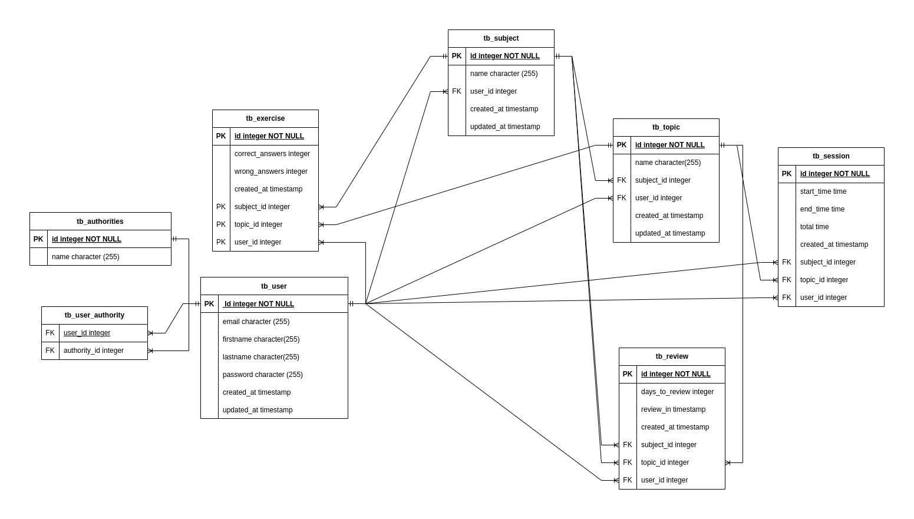

## Eduplanner
Eduplanner é uma aplicação para controle de métricas com objetivo de melhorar o desempenho de estudantes, auxiliando a 
identificação de pontos fortes e fracos durante sua trajetória e estudos.

## Principais tecnologias utilizadas
- Java 21
- PostgresSQL
- Spring Boot
- Spring Data JPA
- Spring Security
- Swagger
- Docker 
- Flyway

## Funcionalidades implementadas
- Cadastro de usuário
- Login de usuário
- Atualização de senha de usuário
- Cadastro de disciplina
- Cadastro de tema
- Registro e agendamento de revisões
- Registro de bateria de questões realizadas
- Ranking de disciplinas com melhor desempenho

## Diagrama entidade relacionamento em banco de dados
A imagem abaixo é uma representação do banco de dados da aplicação, dependendo da versão determinada tabela pode ter 
mais ou menos atributos




## Endpoints 
| Endpoint                          | descrição                                                  | Método HTTP |
|-----------------------------------|------------------------------------------------------------|-------------|
| /api/v1/users/register            | Cadastro de novos usuário                                  | POST        |
| /api/v1/users/signIn              | Login de usuário cadastrado                                | POST        |      
| /api/v1/users/updatePass          | Atualização de senha                                       | POST        |      
| /api/v1/users/signIn              | Login de usuário cadastrado                                | POST        |      
| /api/v1/users/info                | Estatísticas gerais de desempenho de usuário               | GET         |      
| /api/v1/subjects/save             | Salvar uma nova matéria                                    | POST        |      
| /api/v1/subjects/all              | Buscar todos as matérias cadastradas                       | GET         |      
| /api/v1/subjects/findById/{id}    | Buscar matéria cadastrada por id                           | GET         |      
| /api/v1/subjects/remove/{id}      | Remover disciplina por id                                  | DELETE      |      
| /api/v1/topics/save               | Salvar um novo tema                                        | POST        |      
| /api/v1/topics/all                | Busca todos os temas cadastrados                           | GET         |      
| /api/v1/topics/findById/{topicId} | Busca tema por id                                          | GET         |      
| /api/v1/topics/remove/{topicId}   | Remove tema cadastrado                                     | DELETE      |      
| /api/v1/exercises/save            | Salva um novo exercício                                    | POST        |      
| /api/v1/exercises/all             | Busca todos os exercícios cadastrados                      | GET         |      
| /api/v1/exercises/rates           | Busca taxas global de desempenho dos exercícios realizados | GET         |      
| /api/v1/exercises/remove/{id}     | Remove exercício realizado                                 | DELETE      |      
| /api/v1/exercises/update/{id}     | Atualiza exercicio cadastrado                              | PUT         |      
| /api/v1/reviews/save              | Salva uma nova revisão                                     | POST        |      
| /api/v1/reviews/findAll           | Busca todas as revisões cadastradas                        | GET         |      
| /api/v1/reviews/remove/{id}       | Remove uma revisão cadastrada                              | DELETE      |      
| /api/v1/reviews/edit              | Edita uma revisão cadastrada                               | PUT         |      
| /api/v1/sessions/save             | Salva uma nova sessão de estudos                           | POST        |      
| /api/v1/sessions/all              | Busca todas as sessões cadastradas                         | GET         |      
| /api/v1/sessions/remove/{id}      | Remove uma sessão cadastrada                               | DELETE      |

## Instruções para autenticação

Após o cadastro, é necessário enviar uma requisição com a seguinte estrutura:

````
    {
        "email":"jhon.doe@provider.com",
        "password":"myP4ss!"
    }
````

Quando usuário é autenticado com sucesso, será retornado um token do tipo Jwt no cabeçalho da requisição com a descrição `jwt_response`